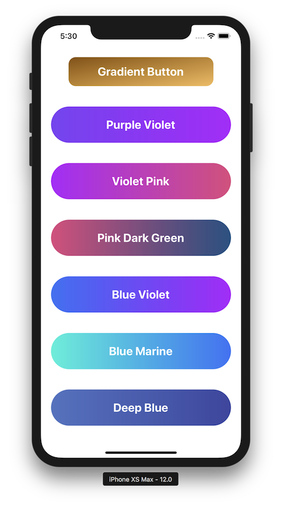

# React Native Gradient Buttons [](https://twitter.com/intent/tweet?text=Gradient%20buttons%20in%20%40reactnative%20by%20%40thomaswangio%20with%201%20line%20of%20code%21%20Instructions%20here%3A%20https%3A%2F%2Fgithub.com%2Fthomaswangio%2Freact-native-gradient-buttons)

[](https://www.npmjs.com/package/react-native-gradient-buttons)
[](https://facebook.github.io/react-native/)
[](https://github.com/thomaswangio/react-native-gradient-buttons/blob/master/LICENSE)

A lightweight, customizable and haptic Gradient Button library for React Native.



## Requirements
Requires React, React Native, and Expo.

## Installation

```
yarn add react-native-gradient-buttons
# or
npm install --save react-native-gradient-buttons
```

## Usage

```
# ES6 import
import GradientButton from 'react-native-gradient-buttons';
```

## Props
  - `style`: `ViewStyle`
    - No default
    - options: any styles you want to apply to the button   
  - `text`: `String`
    - No default
    - options: any string
  - `textStyle`: `TextSyle`
    - No default
    - options: any styles you want to apply to the text   
  - `gradientBegin`: `String` 
    - default: `'#00d2ff'`
    - options: Any hex, rgb, or color    
  - `gradientEnd`: `String`
    - default: `'#3a47d5'`
    - options: Any hex, rgb, or color
  - `gradientDirection`: `String`
    - default: `'horizontal'`
    - options: `'horizontal'`, `'vertical'`, `'diagonal'`
  - `height`: `Number` or `String` (for %)
    - default: `75`
    - options: any number
  - `width`: `Number` or `String` (for %)
    - No default
    - options: any number
  - `radius`: `Number`
    - default: `50`
    - options: any number
  - `impact`: `Boolean`
    - default: `false`
    - options: `true` or `false`
  - `impactStyle`: `String`
    - default: `'Heavy'`
    - options: `'Heavy'`, `'Medium'`, `'Light'`
  - `onPressAction`: `Function`
    - No default
    - options: any function you want to pass to the Gradient Button 

  **Design+Code Specifc Gradient Props**
  - purpleViolet
  - violetPink
  - pinkDarkGreen
  - blueViolet
  - blueMarine
  - deepBlue

## Examples

```
  <View style={{flex: 1, justifyContent: 'space-evenly', alignItems: 'center', marginVertical: 24}}>
    <GradientButton
      style={{ marginVertical: 8 }}
      text="Gradient Button #1"
      textSyle={{ fontSize: 20 }}      
      gradientBegin="#874f00"
      gradientEnd="#f5ba57"
      gradientDirection="diagonal"
      height={60}
      width={300}
      radius={15}
      impact
      impactStyle='Light'
      onPressAction={() => alert('You pressed me!')}
    />

    <GradientButton
      style={{ marginVertical: 8 }}
      textSyle={{ fontSize: 20 }}      
      gradientBegin="#874f00"
      gradientEnd="#f5ba57"
      gradientDirection="diagonal"
      height={60}
      width={300}
      radius={15}
      impact
      impactStyle='Light'
      onPressAction={() => alert('You pressed me!')}
    >
      Gradient Button #2   
    </GradientButton>
    
    <GradientButton text="Purple Violet" width='90%' purpleViolet impact />
    <GradientButton text="Violet Pink" width='90%' violetPink impact />
    <GradientButton text="Pink Dark Green" width='90%' pinkDarkGreen impact />
    <GradientButton text="Blue Violet" width='90%' blueViolet impact />
    <GradientButton text="Blue Marine" width='90%' blueMarine impact />
    <GradientButton text="Deep Blue" width='90%' deepBlue impact />
  </View>
```

*For a more detailed example, see my example project*: [React Native Auth Screens](https://github.com/thomaswangio/auth-screens).
